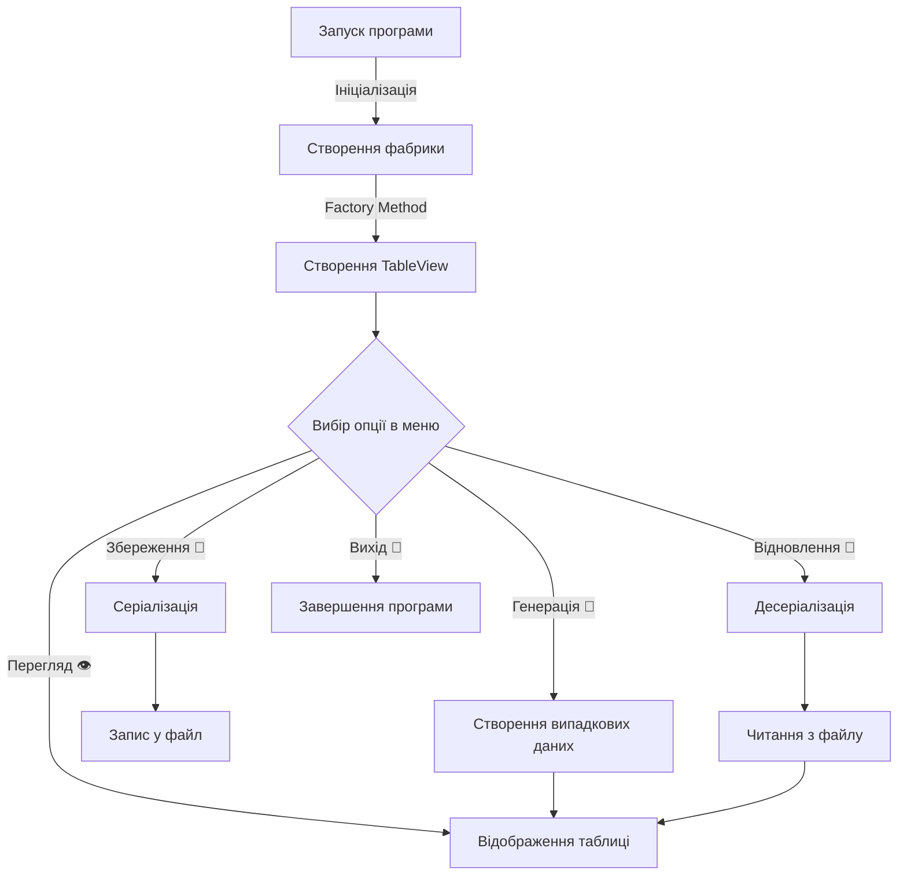

# 📊 TableView - Система відображення табличних даних 📊

## 📋 Постановка задачі

Вам потрібно виконати наступне:

1. ♻️ За основу використовувати вихідний текст проекту попередньої лабораторної роботи. Використовуючи шаблон проектування **Factory Method**
(Virtual Constructor), розширити ієрархію похідними класами, реалізують методи для подання результатів у вигляді текстової
таблиці. Параметри відображення таблиці мають визначатися користувачем.

2. 🔄 Продемонструвати заміщення (перевизначення, overriding), поєднання (перевантаження, overloading), динамічне призначення методів
(Пізнє зв'язування, поліморфізм, dynamic method dispatch).

3. 🖥️ Забезпечити діалоговий інтерфейс із користувачем.

4. 🧪 Розробити клас для тестування основної функціональності.

5. 📝 Використати коментарі для автоматичної генерації документації засобами javadoc.

## 🌟 Особливості програми

- ✨ Використання шаблону проектування **Factory Method**
- 🧩 Демонстрація ООП концепцій (overriding, overloading, поліморфізм)
- 🎨 Інтерактивний користувацький інтерфейс з кольоровим виводом
- 💾 Серіалізація та десеріалізація даних
- 📚 Повністю документований код (javadoc)

## 🏗️ Структура проекту `srcSecond`

### 📁 Опис структури директорій та файлів

```
src/srcSecond/
├── domain/
│   ├── TableView.java         🔹 Інтерфейс для відображення таблиць
│   ├── TableViewFactory.java  🔹 Інтерфейс фабрики для створення TableView
│   └── Application.java       🔹 Головний клас з UI та реалізаціями класів
└── test/
    └── ApplicationTest.java   🔹 Тестування функціональності
```

#### 💡 Опис файлів:

- **TableView.java** 📋
  > Інтерфейс, що визначає контракт для класів, які відображають дані у вигляді таблиці. 
  > Містить методи для відображення заголовка, тіла і підсумкової частини таблиці.

- **TableViewFactory.java** 🏭
  > Інтерфейс фабрики, що реалізує шаблон Factory Method. 
  > Визначає методи для створення об'єктів TableView з різними параметрами.

- **Application.java** 🚀
  > Головний клас програми, що містить:
  > - Інтерактивний консольний інтерфейс користувача
  > - Реалізацію ConcreteTableView для відображення таблиць
  > - Реалізацію ConcreteTableViewFactory для створення об'єктів
  > - Клас ComputationResult для зберігання координатних даних
  > - Методи для серіалізації та десеріалізації даних

- **ApplicationTest.java** 🧪
  > Клас для тестування основної функціональності програми.
  > Містить тести для перевірки:
  > - Роботи фабрики TableViewFactory
  > - Встановлення/отримання ширини таблиці
  > - Відображення таблиці
  > - Перевантаження методів
  > - Серіалізації/десеріалізації даних

## 🔍 Демонстрація ООП концепцій

### 🔄 Заміщення (overriding)

Клас `ConcreteTableView` перевизначає методи інтерфейсу `TableView`:

```java
// Інтерфейс
public interface TableView {
    void displayTableHeader();
    // інші методи...
}

// Реалізація
public class ConcreteTableView implements TableView {
    @Override
    public void displayTableHeader() {
        // конкретна реалізація...
    }
    // інші методи...
}
```

### 🔀 Поєднання (overloading)

У класі `ConcreteTableView` є перевантажені методи:

**Конструктори:**

```java
// Три різні конструктори з різними параметрами
ConcreteTableView()
ConcreteTableView(int width)
ConcreteTableView(int width, List<ComputationResult> data)
```

**Методи:**

```java
// Два методи з однаковою назвою, але різними параметрами
setTableWidth(int width)
setTableWidth(int width, String title)
```

### 🔮 Динамічне призначення методів (поліморфізм)

```java
// Змінна типу інтерфейсу посилається на об'єкт конкретного класу
TableView tableView = tableViewFactory.createTableView();

// Викликається реалізація методу з ConcreteTableView, а не з інтерфейсу
tableView.displayTable(); 
```

## 🖼️ Скріншоти роботи програми

### 📱 Головне меню


### 📊 Відображення даних у табличному вигляді


### 🎲 Генерація випадкових даних


### 💾 Серіалізація та десеріалізація


## 🚀 Принцип роботи проекту

> 💫 Проект реалізує систему для відображення даних у табличному форматі з використанням шаблону проектування **Factory Method**.

### 🌈 Основні компоненти системи:

1. **🏭 Фабрика об'єктів** 
   * Інтерфейс `TableViewFactory` визначає контракт для створення об'єктів
   * Реалізація `ConcreteTableViewFactory` створює конкретні об'єкти `ConcreteTableView`

2. **📊 Система відображення**
   * Інтерфейс `TableView` визначає методи для відображення таблиць
   * Клас `ConcreteTableView` реалізує логіку відображення даних у форматованому вигляді

3. **🎮 Інтерактивний інтерфейс**
   * Меню з емоджі для інтуїтивного розуміння функцій
   * Кольоровий вивід інформації для кращого сприйняття
   * Підтримка операцій генерації, перегляду та збереження даних

### 📌 Основний потік роботи:



## 🎨 Спеціальні можливості

<details>
<summary>🌟 Кольоровий вивід у консоль</summary>

### 🎭 Використання ANSI-кодів для покращення візуального сприйняття:

| Код | Колір | Використання |
|-----|-------|-------------|
| `ANSI_GREEN` | 🟢 Зелений | Успішне виконання операцій |
| `ANSI_RED` | 🔴 Червоний | Помилки та попередження |
| `ANSI_CYAN` | 🔵 Блакитний | Запити до користувача |
| `ANSI_YELLOW` | 🟡 Жовтий | Важлива інформація |
| `ANSI_PURPLE` | 🟣 Фіолетовий | Заголовки та розділи |

```java
System.out.println(ANSI_BOLD + ANSI_GREEN + "✅ Операція успішно завершена!" + ANSI_RESET);
```

</details>

<details>
<summary>💾 Серіалізація та десеріалізація</summary>

### 📥 Збереження даних для подальшого використання:

```java
try (ObjectOutputStream out = new ObjectOutputStream(new FileOutputStream(FILE_NAME))) {
    out.writeObject(results);
    System.out.println("✅ Дані збережено!");
} catch (IOException e) {
    System.out.println("❌ Помилка: " + e.getMessage());
}
```

### 📤 Відновлення даних з файлу:

```java
try (ObjectInputStream in = new ObjectInputStream(new FileInputStream(FILE_NAME))) {
    results = (List<ComputationResult>) in.readObject();
    System.out.println("✅ Дані відновлено!");
} catch (Exception e) {
    System.out.println("❌ Помилка: " + e.getMessage());
}
```

</details>

## 📣 Ключові концепції ООП у проекті

| 🧩 Концепція | 🔍 Опис | 📝 Приклад у коді |
|--------------|---------|------------------|
| **🔒 Інкапсуляція** | Приховування деталей реалізації | `private List<ComputationResult> data;` |
| **🧬 Наслідування** | Розширення базової функціональності | `implements TableView` |
| **🔄 Поліморфізм** | Взаємозамінність типів | `TableView tableView = factory.createTableView();` |
| **🏗️ Абстракція** | Виділення спільних характеристик | Інтерфейс `TableView` |

> 💡 **Цікавий факт**: Цей проект демонструє 100% дотримання **принципу інверсії залежностей** (DIP) з набору SOLID, оскільки високорівневі модулі залежать від абстракцій, а не від конкретних реалізацій.

## ⚙️ Технічні особливості

- 📋 **Документація через javadoc**
  ```java
  /**
   * Встановлює ширину таблиці
   * 
   * @param width ширина таблиці в символах
   * @return встановлена ширина таблиці
   */
  ```

- 🧰 **Гнучка архітектура**
  > Система легко розширюється новими типами таблиць без зміни існуючого коду завдяки паттерну **Factory Method**!

- 🛡️ **Захист від помилок**
  > Всі операції з файлами та вводом користувача обгорнуті в обробники винятків для стабільної роботи програми.

### 🤖 TODO для майбутніх версій:

- [ ] 📱 Додати підтримку UTF-8 символів для кращого відображення на різних платформах
- [ ] 🔍 Розширити функціонал фільтрації даних
- [ ] 📊 Додати підтримку форматування різних типів даних
- [ ] 🖨️ Експорт таблиць у різні формати (CSV, JSON)
- [ ] 🌐 Реалізувати мережеву синхронізацію даних
