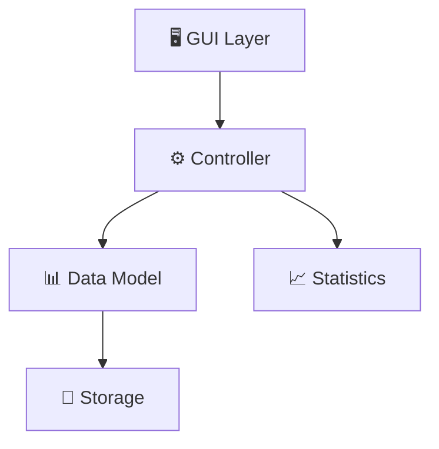
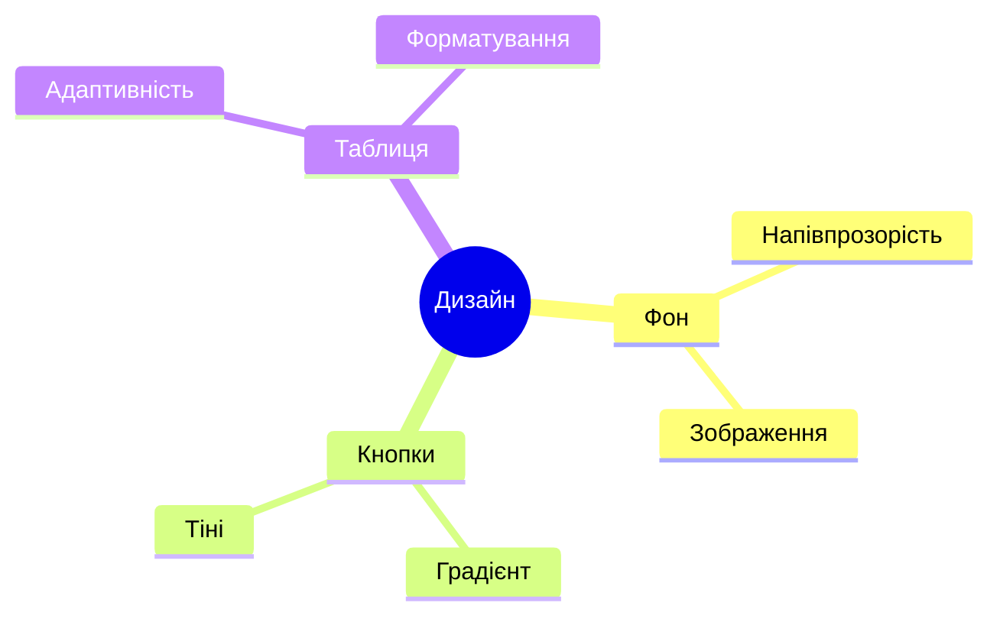

# 📊 Додаток для Аналізу Даних на JavaFX

> 🎯 Інтерактивний додаток для маніпуляції даними та статистичного аналізу з сучасним графічним інтерфейсом

## 📝 Постановка Задачі

### 🎯 Основна мета
1. 🖥️ Розробити графічний інтерфейс користувача (GUI)
2. 📊 Реалізувати функціонал для роботи з даними
3. 💾 Забезпечити збереження та завантаження даних
4. 📈 Впровадити статистичний аналіз

### 📋 Вимоги до проєкту
| № | Вимога | Пріоритет |
|---|---------|-----------|
| 1 | Створення таблиці з парами (X,Y) | ⭐⭐⭐ |
| 2 | Генерація випадкових значень | ⭐⭐⭐ |
| 3 | Збереження/завантаження даних | ⭐⭐ |
| 4 | Статистичний аналіз | ⭐⭐⭐ |
| 5 | Маніпуляція значеннями Y | ⭐⭐ |

### 🔄 Життєвий цикл даних


## 🛠️ Технічний Стек

### 💻 Основні технології
| Технологія | Версія | Призначення | Статус |
|------------|---------|-------------|---------|
| Java | 17 | Основна мова | ✅ |
| JavaFX | 19 | GUI фреймворк | ✅ |
| CSS | 3 | Стилізація | ✅ |
| Серіалізація | Java Native | Збереження | ✅ |

### 🏗️ Архітектура додатку


## 🎮 Функціональність

### 📊 Доступні операції
| Команда | Опис | Результат |
|---------|------|-----------|
| СТВОРИТИ_ТАБЛИЦЮ | Створення таблиці | 📋 10 рядків |
| ГЕНЕРУВАТИ_ЗНАЧЕННЯ | Випадкові дані | 🎲 [-10;10] |
| ЗБЕРЕГТИ_ЗНАЧЕННЯ | Збереження | 💾 data.ser |
| ПЕРЕГЛЯНУТИ_ЗНАЧЕННЯ | Завантаження | 📂 З файлу |
| ЗМІНИТИ_Y | Модифікація Y | 🔄 [0.5;2.0] |
| ПОКАЗАТИ_СТАТИСТИКУ | Аналіз | 📈 4 метрики |

### 📈 Статистичні функції
- 📊 Середнє значення X
- 📉 Середнє значення Y
- 📈 Мінімальне позитивне Y
- 📊 Максимальне негативне Y

## 🎨 Дизайн та Інтерфейс

### 🖼️ Елементи стилізації


## 🚀 Інструкція з Використання

1. 📥 **Підготовка середовища**
   - ✅ Java 17+
   - ✅ JavaFX 19+

2. 🖥️ **Запуск додатку**
   ```bash
   mvn clean javafx:run
   ```

3. 📊 **Робота з даними**
   - ➡️ Оберіть команду
   - ⚡ Натисніть "Виконати"
   - 📋 Перегляньте результат

## 🔒 Зберігання Даних

### 📦 Формат зберігання
| Параметр | Значення |
|----------|----------|
| Формат | .ser |
| Тип | Бінарний |
| Захист | ✅ |
| Версійність | ✅ |

## ⚡ Особливості Реалізації

- 🎯 **Архітектурні принципи**
  1. 📱 Адаптивний дизайн
  2. 🔄 MVC патерн
  3. 🛠️ SOLID принципи
  4. ⚡ Ефективність

- 🎨 **UI/UX особливості**
  1. 🖼️ Інтуїтивний інтерфейс
  2. 🎯 Миттєвий відгук
  3. 📱 Адаптивність
  4. 🎨 Сучасний дизайн

## 📸 Скріншоти Виконання Програми

### 0️⃣ Головне меню

*Основний екран з вибором дій*

### 1️⃣ Створити таблицю

*Створення нової таблиці з 10 порожніми рядками*

### 2️⃣ Згенерувати значення

*Заповнення таблиці випадковими значеннями в діапазоні [-10;10]*

### 3️⃣ Зберегти значення

*Збереження даних у файл data.ser*

### 4️⃣ Переглянути значення

*Завантаження збережених даних з файлу*

### 5️⃣ Змінити значення стовпця Y

*Модифікація значень стовпця Y випадковим коефіцієнтом [0.5;2.0]*

### 6️⃣ Показати статистику

*Відображення статистичних даних по таблиці*

### 7️⃣ Вихід

*Завершення роботи програми*

---

<div align="center">
  
  *Розроблено з використанням шаблонів проектування та принципів ООП*
  
  
  
  
</div>
