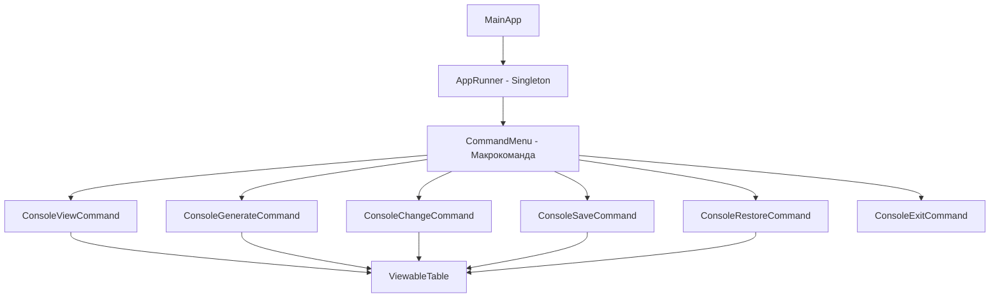

# 🚀 Консольний додаток для обробки колекцій
[](https://github.com/codespaces/new?hide_repo_select=true&ref=task-5-processing-of-collections-(07.03.25)&repo=941975572)

---

## 📋 Постановка задачі

| № | Завдання | Статус |
|:--:|:----------|:------:|
| 1️⃣ | Реалізувати можливість скасування (undo) операцій | ✅ |
| 2️⃣ | Продемонструвати поняття "макрокоманда" | ✅ |
| 3️⃣ | Використовувати шаблон Singleton | ✅ |
| 4️⃣ | Забезпечити діалоговий інтерфейс із користувачем | ✅ |
| 5️⃣ | Розробити клас для тестування функціональності | ✅ |

---

## 🧩 Опис програми

<div align="center">
  
  ### 🎯 **Функціональність програми**
  
</div>

Додаток представляє собою консольну програму для роботи з двовимірними координатами (x, y), які зберігаються в таблиці. Програма реалізує шаблон проектування Command, що дозволяє інкапсулювати запити як об'єкти та забезпечує можливість скасування операцій.



### 📊 Основні можливості програми:

<table>
  <tr>
    <th>Операція</th>
    <th>Опис</th>
    <th>Команда</th>
  </tr>
  <tr>
    <td>👁️ Перегляд даних</td>
    <td>Відображення поточних значень таблиці</td>
    <td><kbd>д</kbd></td>
  </tr>
  <tr>
    <td>🎲 Генерація даних</td>
    <td>Створення набору випадкових координат</td>
    <td><kbd>г</kbd></td>
  </tr>
  <tr>
    <td>🔧 Зміна даних</td>
    <td>Модифікація значень за допомогою коефіцієнта</td>
    <td><kbd>м</kbd></td>
  </tr>
  <tr>
    <td>🔍 Переглянути дані</td>
    <td>Перегляд оновлених даних після зміни</td>
    <td>Автоматично після <kbd>м</kbd></td>
  </tr>
  <tr>
    <td>💾 Збереження даних</td>
    <td>Серіалізація поточного стану для можливості відміни</td>
    <td><kbd>з</kbd></td>
  </tr>
  <tr>
    <td>📂 Відновлення даних</td>
    <td>Десеріалізація збереженого стану (undo операція)</td>
    <td><kbd>п</kbd></td>
  </tr>
  <tr>
    <td>🚪 Вихід з програми</td>
    <td>Можливість завершення роботи</td>
    <td><kbd>в</kbd></td>
  </tr>
</table>

---

## 🏗️ Архітектурні особливості

<div align="center">
  
  ### 🧠 **Дизайн патерни в проекті**
  
</div>

| Патерн | Опис | Клас |
|:-------|:-----|:-----|
| **Command** | Інкапсуляція запитів як об'єктів | `ICommand`, `IConsoleCommand` та реалізації |
| **Singleton** | Гарантує єдиний екземпляр класу | `AppRunner` |
| **Composite** | Макрокоманда як композиція команд | `CommandMenu` |
| **Memento** | Збереження та відновлення стану об'єкта | `ConsoleSaveCommand`, `ConsoleRestoreCommand` |

<details>
  <summary>🔍 Детальний аналіз шаблону Command</summary>

```
ICommand (Інтерфейс)
  └── execute() - Виконує команду

      IConsoleCommand (Інтерфейс, розширює ICommand)
        ├── getKey() - Символ для виклику команди
        └── toString() - Текстовий опис команди

            ConsoleViewCommand - Перегляд даних
            ConsoleGenerateCommand - Генерація випадкових даних
            ConsoleChangeCommand - Модифікація даних
            ConsoleSaveCommand - Збереження стану
            ConsoleRestoreCommand - Відновлення стану (undo)
            ConsoleExitCommand - Завершення програми
```

</details>

---

## 📸 Скріншоти виконання програми

<div align="center">

### 📋 Головне меню

*Консольний інтерфейс із кольоровим виділенням доступних команд*

</div>

<div style="display: flex; justify-content: space-between;">
  <div style="flex: 1; margin-right: 10px;">
    <h3>🎲 Генерація даних</h3>
    
    <em>Створення набору випадкових координат (x, y)</em>
  </div>
  <div style="flex: 1; margin-left: 10px;">
    <h3>🔧 Зміна даних</h3>
    
    <em>Модифікація Y-координат за коефіцієнтом</em>
  </div>
</div>

<div style="display: flex; justify-content: space-between; margin-top: 20px;">
  <div style="flex: 1; margin-right: 10px;">
    <h3>🔍 Перегляд після зміни</h3>
    
    <em>Можливість переглянути дані після їх модифікації</em>
  </div>
  <div style="flex: 1; margin-left: 10px;">
    <h3>💾 Збереження стану</h3>
    
    <em>Серіалізація поточного стану для подальшого відновлення</em>
  </div>
</div>

<div style="display: flex; justify-content: space-between; margin-top: 20px;">
  <div style="flex: 1; margin-right: 10px;">
    <h3>📂 Відновлення стану</h3>
    
    <em>Реалізація undo через відновлення збереженого стану</em>
  </div>
  <div style="flex: 1; margin-left: 10px;">
    <h3>🚪 Вихід після відновлення</h3>
    
    <em>Пропозиція завершити роботу після відновлення даних</em>
  </div>
</div>

---

## 🧪 Тестування

<div align="center">
  
  ### 🔬 **Автоматизовані тести**
  
</div>


*Результати автоматизованого тестування функціональності програми*

<details>
  <summary>📝 Деталі тестування</summary>

Тестовий клас `AppTest` перевіряє:
- ✅ Правильне створення та ініціалізація об'єктів
- ✅ Коректність генерації випадкових даних
- ✅ Зміну значень координат з коефіцієнтом
- ✅ Збереження та відновлення стану (функціонал undo)
- ✅ Правильність форматування та відображення таблиці

</details>

---

<div align="center">
  
  ## 💡 Реалізація undo-функціональності
  
</div>

```
┌─────────┐        ┌───────────────┐        ┌───────────────┐
│ Команда │        │  Збереження   │        │ Відновлення   │
│ зміни   │───────▶│  стану        │───────▶│ стану         │
│ даних   │        │               │        │               │
└─────────┘        └───────────────┘        └───────────────┘
      │                    │                       │
      │                    │                       │
      ▼                    ▼                       ▼
┌─────────────────────────────────────────────────────────┐
│                                                         │
│                     ViewableTable                       │
│                                                         │
└─────────────────────────────────────────────────────────┘
```

Механізм скасування (undo) реалізований через:
1. 💾 **Серіалізацію** - збереження поточного стану таблиці у файл
2. 📂 **Десеріалізацію** - відновлення збереженого стану з файлу
3. 🔄 **Команди** - інкапсуляція функціональності в окремі класи команд

---

<div align="center">
  
  *Розроблено з використанням шаблонів проектування та принципів ООП*
  
  
  
  
</div>
