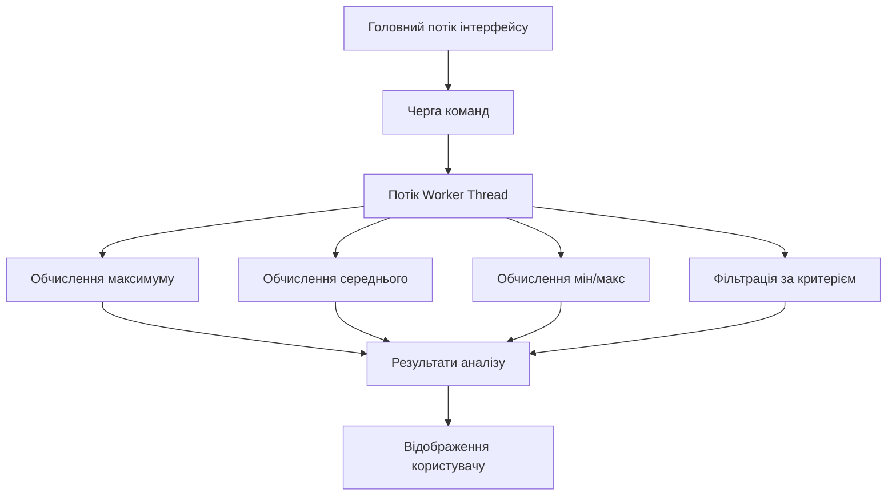
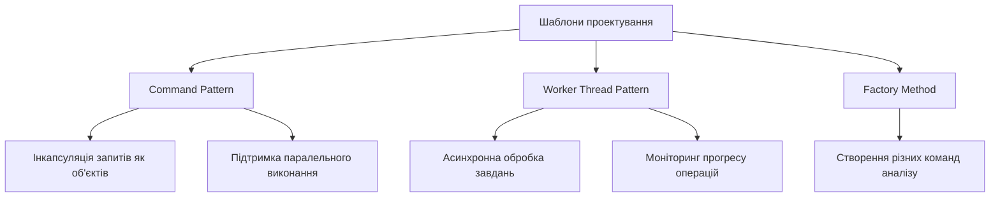
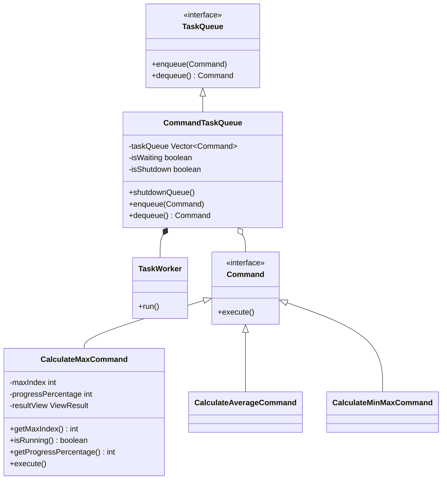

🚀 ParallelDataProcessor — Двовимірний аналіз даних

## 📝 Постановка задачі

**Вам потрібно виконати наступне:**

1. 🔄 **Продемонструвати можливість паралельної обробки елементів колекції**:
   - 🔍 Пошук мінімуму та максимуму
   - 📏 Обчислення середнього значення
   - 🔎 Відбір за критерієм
   - 📊 Статистична обробка даних

2. 🧵 **Управління чергою завдань (команд) реалізувати за допомогою шаблону Worker Thread**:
   - 📋 Створення черги команд
   - 🔄 Асинхронне виконання завдань
   - 📡 Моніторинг прогресу виконання

Програма має забезпечувати ефективну обробку даних з використанням паралельних обчислень та надавати користувачеві зручний інтерфейс для взаємодії.

## ⚙️ Функціональність

<div align="center">

| 🔑 Команда | 🔤 Символ | 📋 Опис |
|:----------:|:--------:|:-------|
| 👁️ Переглянути дані | `п` | Відображення поточного набору даних у вигляді таблиці |
| 🔄 Генерувати дані | `г` | Створення нового набору випадкових двовимірних точок |
| 📝 Змінити значення | `з` | Редагування Y-координат елементів з коефіцієнтом |
| 📊 Аналізувати дані | `а` | Запуск комплексного паралельного аналізу даних |
| 🚪 Вихід | `в` | Завершення роботи програми |

</div>

## 🧵 Паралельна обробка даних

У програмі реалізовано паралельну обробку даних з використанням окремих потоків для виконання різних обчислювальних задач:



### 🔄 Механізм паралельних обчислень

Програма використовує **три незалежні черги завдань**:

1. **Черга 1**: Обробка завдань мінімуму/максимуму
2. **Черга 2**: Обробка завдань максимального значення
3. **Черга 3**: Обробка завдань середнього значення

<div align="center">

| ⚡ Тип операції | 🔄 Алгоритм | ⏱️ Прогрес моніторингу |
|----------------|------------|----------------------|
| Пошук максимуму | Послідовне порівняння | Через кожні 33% елементів |
| Пошук мін/макс | Розподіл на підзадачі | Через кожні 20% елементів |
| Обчислення середнього | Паралельне підсумовування | Через кожні 50% елементів |
| Пошук екстремумів X/Y | 10 паралельних потоків | По завершенню всіх потоків |

</div>

## 🔄 Worker Thread шаблон

У проекті реалізовано шаблон проектування **Worker Thread** через класи:

<div align="center">

```
┌─────────────────┐      ┌─────────────────┐      ┌─────────────────┐
│   TaskQueue     │      │CommandTaskQueue  │      │   TaskWorker    │
│    interface    │◄─────│  implementation  │◄─────│  inner class    │
└─────────────────┘      └─────────────────┘      └─────────────────┘
        ▲                        ▲
        │                        │
┌─────────────────┐      ┌─────────────────┐
│     Command     │      │CommandImplement │
│    interface    │◄─────│     ations      │
└─────────────────┘      └─────────────────┘
```

</div>

Схема роботи Worker Thread:

1. ➕ **Додавання команди**: Команда додається до черги `enqueue()`
2. 🔄 **Обробка потоком**: Робочий потік викликає `dequeue()` і отримує команду
3. ▶️ **Виконання**: Потік виконує метод `execute()` команди
4. 📈 **Моніторинг**: Основний потік відстежує прогрес через `getProgressPercentage()`

## 📊 Приклади використання

### 👁️ Перегляд даних

<div align="center">
  
  ```
  ╔═════╦════════════╦════════════╗
  ║ №   ║     X      ║     Y      ║
  ╠═════╬════════════╬════════════╣
  ║ 0   ║     -3.52  ║      7.89  ║
  ║ 1   ║      1.67  ║     -2.34  ║
  ║ 2   ║      4.92  ║      9.01  ║
  ║ 3   ║     -0.78  ║     -5.67  ║
  ║ 4   ║      2.15  ║      4.23  ║
  ╚═════╩════════════╩════════════╝
  ```
  
  
  
</div>

### 🔄 Генерація нових даних

<div align="center">
  
  ```
  ✨ ДАНІ УСПІШНО ЗГЕНЕРОВАНО ✨
  ══════════════════════════════════════
  📋 Результат:
  ╔═════╦════════════╦════════════╗
  ║ №   ║     X      ║     Y      ║
  ╠═════╬════════════╬════════════╣
  ║ 0   ║      2.18  ║     -8.97  ║
  ║ 1   ║     -4.56  ║      3.21  ║
  ║ 2   ║      0.12  ║      5.67  ║
  ║ 3   ║      3.45  ║     -1.23  ║
  ║ 4   ║     -2.78  ║      6.90  ║
  ╚═════╩════════════╩════════════╝
  ```
  
  
  
</div>

### 📝 Зміна значення Y

<div align="center">
  
  ```
  🔧 ЗМІНА ЗНАЧЕНЬ Y В ТАБЛИЦІ 🔧
  ══════════════════════════════════════
  🔄 Згенеровано коефіцієнт масштабування: 1.75
  ✅ Значення Y успішно змінено для всіх елементів!
  ══════════════════════════════════════
  ```
  
  
  
</div>

### 📊 Аналіз даних

<div align="center">
  
  ```
  ✅ АНАЛІЗ ДАНИХ ЗАВЕРШЕНО ✅

  📊 РЕЗУЛЬТАТИ АНАЛІЗУ:
  ╔═════════════════════════════════════════════════════╗
  ║ 📈 ДЕТАЛЬНА СТАТИСТИКА ДАНИХ                        ║
  ╠═════════════════════════════╦═══════════════════════╣
  ║ 🔍 Максимальне значення     ║ x = 4.92     y = 15.77 ║
  ╠═════════════════════════════╬═══════════════════════╣
  ║ 📊 Середнє арифметичне X    ║ 0.89                  ║
  ║ 📊 Середнє арифметичне Y    ║ 2.33                  ║
  ╠═════════════════════════════╬═══════════════════════╣
  ║ 🔼 Мінімальне додатнє       ║ 2.14                  ║
  ║ 🔽 Максимальне від'ємне     ║ -0.56                 ║
  ╚═════════════════════════════╩═══════════════════════╝
  ```
  
  
  
</div>

### 🚪 Вихід з програми

<div align="center">
  
  ```
  👋 Дякуємо за використання програми!
  🔒 Програма завершується...
  ```
  
</div>

## 🧪 Результати тестування

<div align="center">
  
  ```
  ╔═══════════════════════════════════════════════════════╗
  ║                 РЕЗУЛЬТАТИ ТЕСТУВАННЯ                 ║
  ╠═══════════════════════════════════════════════════════╣
  ║ ✓ Перевірка View: успішно                            ║
  ║ ✓ Перевірка змінення елементів: успішно              ║
  ║ ✓ Перевірка обчислення мінімуму: успішно             ║
  ║ ✓ Перевірка обчислення максимуму: успішно            ║
  ║ ✓ Перевірка обчислення середнього: успішно           ║
  ║ ✓ Перевірка паралельної обробки: успішно             ║
  ║ ✓ Перевірка Worker Thread: успішно                   ║
  ║                                                       ║
  ║ ✅ Всі тести пройдені успішно!                        ║
  ╚═══════════════════════════════════════════════════════╝
  ```
  
  
  
</div>

## 📸 Скріншоти виконання

### 👁️ Переглянути дані


### 🔄 Генерувати нові дані


### 📝 Змінити значення Y


### 📊 Аналізувати дані


### 🚪 Вихід - завершити програму


## 🧪 Виконання тесту


## 🌟 Шаблони проектування

У проекті використано наступні шаблони проектування:



### Діаграма класів Worker Thread



---

<div align="center">
  
  *Розроблено з використанням принципів ООП та паттернів проектування*
  
  
  
  
  
</div>
